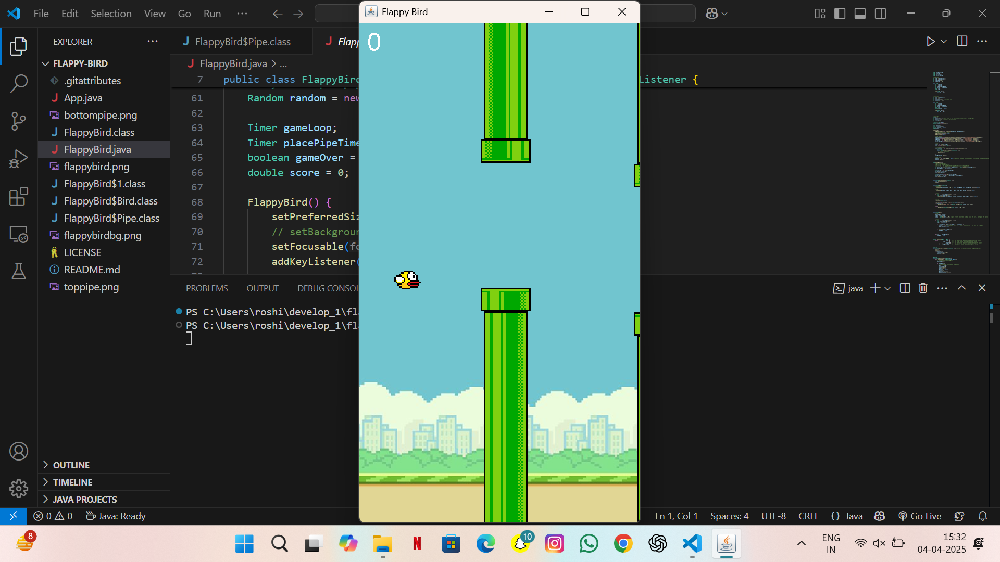

Here's a `README.md` file tailored for your [Flappy Bird project](https://github.com/Roshitha-Kommana/flappy-bird), acknowledging the original source and tutorial inspiration:

---

```markdown
# Flappy Bird - Java Game

This is a simple **Flappy Bird** game clone built using **Java** and **Java Swing**. The game mimics the core mechanics of the original Flappy Bird—click or press the spacebar to flap and avoid hitting the pipes.

> ⚠️ This project is a **re-creation** based on a [YouTube tutorial by Kenny Yip](https://www.youtube.com/watch?v=Xw2MEG-FBsE) and the original code from [ImKennyYip/flappy-bird-java](https://github.com/ImKennyYip/flappy-bird-java).

## 🔗 Project Link

GitHub Repository: [https://github.com/Roshitha-Kommana/flappy-bird](https://github.com/Roshitha-Kommana/flappy-bird)

## 🎮 Features

- Smooth Flappy Bird game mechanics
- Pipe generation and collision detection
- Scoring system
- Replay option on game over
- Built using Java Swing GUI framework

## 📸 Screenshots



## ▶️ How to Play

- **Jump/Flap**: Press `Spacebar` or click the mouse
- **Avoid** hitting the top, bottom, or pipes
- **Score** increases each time you pass through a pair of pipes

## 🛠️ Tech Stack

- Java (JDK 8+)
- Java Swing for GUI

## 🧠 Learning Source

This project was built by following:

- 🎥 [Kenny Yip's YouTube tutorial](https://www.youtube.com/watch?v=Xw2MEG-FBsE)
- 💻 [Original GitHub Repository by ImKennyYip](https://github.com/ImKennyYip/flappy-bird-java)

All credits go to **Kenny Yip** for the amazing tutorial and base code.

## 🚀 Getting Started

1. Clone the repository:
   ```bash
   git clone https://github.com/Roshitha-Kommana/flappy-bird
   cd flappy-bird
   ```
2. Compile and run the game:
   ```bash
   javac FlappyBird.java
   java FlappyBird
   ```

> Make sure you have Java installed (`java -version`)

## 📁 File Structure

```
FlappyBird.java    # Main game logic
README.md          # Project documentation
```

## 📜 License

This project is for **educational and personal learning purposes only**. Credits go to the original author of the code and video tutorial.

---

Made with 💻 by [Roshitha Kommana](https://github.com/Roshitha-Kommana)
```

